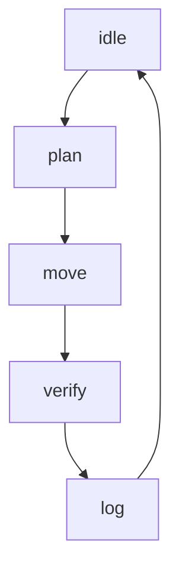

# Arm FSM State Diagram

The FSM uses an `asyncio.Lock` during the `plan → move → verify → log` cycle to
ensure only one motion executes at a time.  New `safety` requests enter the
priority queue ahead of `user` or `background` requests and are processed as soon
as the arm returns to the `idle` state.
